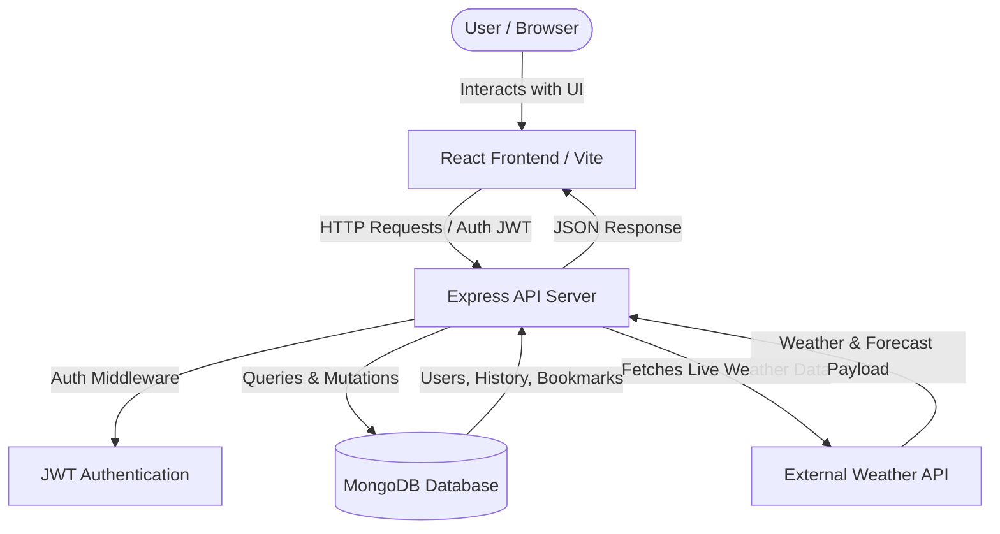

# Live Weather Insights 🌤️

A full-stack, real-time weather analytics and forecast application that delivers detailed meteorological data, interactive search, location bookmarking, and search history tracking for personalized user insights.


---

## 📸 Visual Preview

| Homepage Overview | Detailed Forecast |
| :---: | :---: |
|  |  |

---

## ✨ Features

- 🌡️ **Real-Time Weather Metrics**: Instantly fetch live temperature, atmospheric conditions, wind speed, humidity, and UV levels.
- 📅 **Detailed Multi-Day Forecast**: View comprehensive extended forecasts with daily highs, lows, and hourly trends.
- 🔍 **Interactive Location Search**: Search for cities worldwide with quick dynamic autocompletion and location history.
- 📌 **Personalized Bookmarks**: Save favorite cities and regions to quickly access updated forecasts on login.
- 📜 **Search History Tracking**: Automatically track recent searches tied to user accounts for quick reference.
- 🔐 **User Authentication**: Secure user registration and login functionality backed by JWT middleware.

---

## 📂 Repository Structure

```
live-weather-insights/
├── screenshots/
│   ├── forecast.png
│   └── home.png
├── server/
│   ├── middleware/
│   │   └── auth.js
│   ├── models/
│   │   ├── Bookmarks.js
│   │   ├── History.js
│   │   └── User.js
│   ├── routes/
│   │   ├── auth.js
│   │   ├── bookmarks.js
│   │   ├── history.js
│   │   └── weather.js
│   ├── index.js
│   └── package.json
├── src/
│   ├── components/
│   │   ├── Login_popup.module.css
│   │   ├── Login_popup.tsx
│   │   ├── Register_popup.module.css
│   │   ├── Register_popup.tsx
│   │   ├── Search_bar.tsx
│   │   └── Weather_card.tsx
│   ├── pages/
│   │   ├── Detailed_forecast.tsx
│   │   └── Homepage.tsx
│   ├── App.css
│   ├── App.tsx
│   ├── main.tsx
│   └── types.ts
├── index.html
├── package.json
├── tsconfig.json
└── vite.config.ts
```

---

## 🏗️ Architecture & Data Flow



---

## 🛠️ Tech Stack

| Category | Technologies |
| :--- | :--- |
| **Frontend** | React, TypeScript, Vite, CSS Modules |
| **Backend** | Node.js, Express.js |
| **Database** | MongoDB (Mongoose models for Users, Bookmarks, History) |
| **Authentication** | JSON Web Tokens (JWT) & Custom Middleware |
| **Tooling & Linting** | ESLint, TypeScript Compiler (tsc) |

---

## 🚀 Quick Start

### Prerequisites
- [Node.js](https://nodejs.org/) (v18 or higher recommended)
- [npm](https://www.npmjs.com/) or [yarn](https://yarnpkg.com/)
- Running [MongoDB](https://www.mongodb.com/) instance or URI string

### 1. Clone the Repository
```bash
git clone https://github.com/auysh8/live-weather-insights.git
cd live-weather-insights
```

### 2. Install Dependencies
Install client and server dependencies:

```bash
# Install frontend dependencies
npm install

# Install backend dependencies
cd server
npm install
cd ..
```

### 3. Start Development Servers

**Backend Express Server:**
```bash
cd server
npm start
```

**Frontend Client:**
```bash
# From the root directory
npm run dev
```

Open your browser and navigate to `http://localhost:5173`.

---

## 📖 Available Scripts

### Client Scripts (Root Directory)

| Command | Description |
| :--- | :--- |
| `npm run dev` | Launches Vite local development server |
| `npm run build` | Compiles TypeScript and builds production bundles |
| `npm run preview` | Previews the production build locally |
| `npm run lint` | Runs ESLint analysis across codebase |

### Backend Scripts (`/server` Directory)

| Command | Description |
| :--- | :--- |
| `npm start` | Starts the Express REST API backend server |

---

## 🤝 Contributing

Contributions are always welcome! Follow these steps to submit your work:

1. Fork the Repository.
2. Create a Feature Branch (`git checkout -b feature/AmazingFeature`).
3. Commit your Changes (`git commit -m 'Add some AmazingFeature'`).
4. Push to the Branch (`git push origin feature/AmazingFeature`).
5. Open a Pull Request.

---

## 📄 License

This project is licensed under the MIT License. See the `LICENSE` file for details.